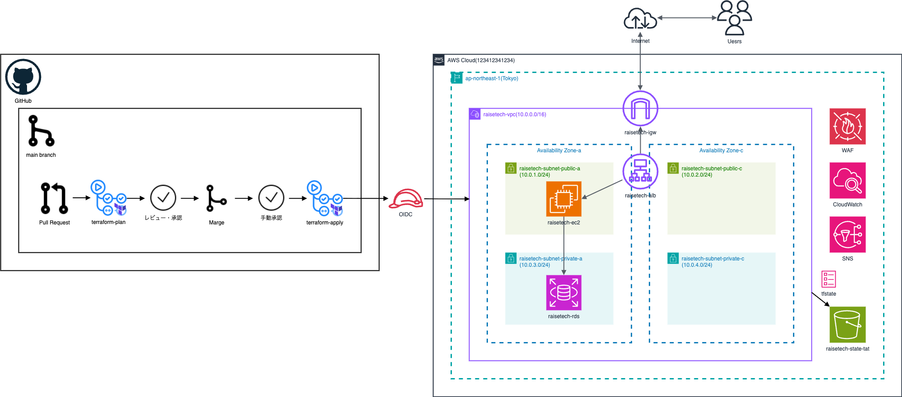

# Terraform と GitHub Actions によるAWSインフラ自動構築

<br>

## 概要
本プロジェクトでは、Terraformを用いたAWSインフラ構築をGitHub Actionsで自動化し、安全かつ効率的なIaCを実現しています。

Pull Requestを起点としたテスト・検証を自動実行し、Mainブランチへのマージを経て環境を構築するCI/CDパイプラインを設計しました。手動承認プロセスの導入により、本番環境への変更における安全性を確保しつつ、継続的なデプロイを可能にする設計としています。

<br>

## 使用技術
**IaC**： Terraform
 
**CI/CD**： GitHub Actions

<br>

## 基本設計
まず、任意のブランチからのpush,pull requestによってterraform-planが実行されます。その後mainブランチへのマージによってterraform-apllyが実行され、手動での承認を経てAWS環境がデプロイされます。
ワークフローは以下の通りです。

1\. 任意のブランチでの`*.tf`ファイルや`.github/workflows/*.yaml`ファイルの変更をGitHubにプッシュ

2\. GitHubのmainブランチへのプルリクエストを作成することで**terraform-plan**を実行

3\. mainブランチにマージすることで**terraform-apply**を実行し手動認証の待機状態へ

4\. GitHub上で手動で認証を行うことでAWSインフラ環境が構築

<br>

## GitHub Actions
GitHub Actionsを活用してTerraformのコード管理と自動デプロイを実現しています。

### terraform-plan.yaml
プルリクエスト作成時に以下のコマンドが実行され、コードの安全性を検証します。

- **terraform init**: Terraform実行に必要なプロバイダやバックエンドの初期化設定
- **terraform fmt**: コードのフォーマットが整っているかチェック
- **terraform validate**: 設定ファイルの文法チェック
- **terraform test**: テストコードによる動作検証
- **terraform plan**: インフラの変更内容の確認

### terraform-apply.yaml
`main`ブランチへのマージ時に以下のコマンドが実行され、インフラ環境をデプロイします。手動承認プロセスを組み込み、より安全性の高いパイプラインとなるようにしています。

- **terraform init**: Terraform実行に必要なプロバイダやバックエンドの初期化設定
- **terraform plan**: インフラの変更内容の確認
- **terraform apply -auto-approve**: 確認済みの変更内容を本番環境へ反映

<br>

## リポジトリ構成

```bash
.
├── .github/workflows/
│   ├── terraform-apply.yaml            # apply(CD) 実行ファイル
│   └── terraform-plan.yaml             # plan(CI) 実行ファイル
│
├── terraform/raisetech/
│   ├── environments/
│   │   └── dev/
│   │       ├── tests/                  # テスト用ファイル
│   │       │   ├── compute.tftest.hcl
│   │       │   ├── datbase.tftest.hcl
│   │       │   └── network.tftest.hcl
│   │       ├── .terraform.lock.hcl     
│   │       ├── backend.tf              # S3設定
│   │       ├── main.tf                 # モジュール呼び出し
│   │       ├── outputs.tf              # 出力値定義
│   │       ├── provider.tf             # プロバイダー設定
│   │       ├── terraform.tfvars        # サンプル変数ファイル
│   │       └── variables.tf            # 変数定義
│   │
│   └── modules/
│       ├── compute/                    # EC2
│       │   ├── main.tf                 
│       │   ├── output.tf
│       │   └── variables.tf
│       ├── database/                   # RDS
│       │   ├── main.tf                 
│       │   ├── output.tf
│       │   └── variables.tf
│       ├── network/                    # VPC,Subnet,IGW,ALB
│       │   ├── main.tf                 
│       │   ├── output.tf
│       │   └── variables.tf
│       ├── operation/                  # CloudWatchAlarm,SNS
│       │   ├── main.tf                 
│       │   ├── output.tf
│       │   └── variables.tf
│       └── security/                   # WAF
│           ├── main.tf                 
│           ├── output.tf
│           └── variables.tf
│ 
├── diagrams/architecture.drawio.png    # AWSインフラ構成図
├── lesson21/lesson21.txt               # 学習記録: GitHub練習
├── lesson27/lesson27.ymal              # 学習記録: CloudFormationによるAWSインフラ構築
├── lesson31/lesson31.ymal              # 学習記録: CloudFormationによるAWSインフラ構築
├── .gitignore
└── README.md
```

<br>

## インフラ構成図


<br>

## 動作確認方法
1\. AWSアカウント・GitHubアカウントを用意

2\. GitHub OIDCを設定（下部参照）

3\. GitHub Secretsを設定（下部参照）

4\. GitHubでEnvironmentsルールを設定(今回の場合はdevを作成し、対象のアカウントを含める)

5\. tfstateファイル管理用S3バケットを作成（**バケット名**: `raisetech-state-tat`, **リージョン**: `ap-northeast-1`）

6\. 任意のブランチでリモートリポジトリへプッシュ

7\. mainブランチへのPRを作成

8\. Actions実行後、GitHub上で手動認証を行いAWSインフラ環境を構築

9\. EC2へSSH接続を行い、Nginxをインストールする

10\. Nginxを起動する

11\. ブラウザ上で`http://< ALBのDNS名>`へアクセス

<br>

### GitHub OIDC
| 項目                             | 設定値                   |
| :-------------------- | :----------------------: | 
| プロバイダのタイプ    | OpenID Connect     | 
| プロバイダの URL           | token.actions.githubusercontent.com    | 
| 対象者                              |   sts.amazonaws.com  |
| カスタム信頼ポリシー                    |   mainブランチへのプルリクエスト及びプッシュに対して実行    |
| 許可ポリシー                     |   AdministratorAccess   |
| ロール名                     |   github-actions-oidc-terraform    |

<br>

### GitHub Secrets
| 説明                             | 変数                    |設定例 |
| :-------------------- | :----------------------: | :--: |
| OIDC用IAMロールARN       | AWS_ROLE_ARN        | arn:aws:iam::123456789012:role/my-role |
| 自分のグローバルアドレス(SSH接続用)           | MY_IP         | 1.2.3.4 |
| EC2 キーペア           | EC2_KEYPAIR         | my_keypair |
| DB パスワード           | DB_PASSWORD          | my_password |
| 通知用メールアドレス | ALARM_EMAIL | my@gmail.com |

<br>

## 工夫した点

### OIDCを用いた認証方式
- GitHub ActionsにOpenID Connect (OIDC)を採用

- 長期的なアクセスキーによる認証を廃止し、セキュアな認証を実現した

### modules化による環境分離
- Terraformのmodules機能を用いて管理しやすい構成とした

### 手動承認フローによる安全なデプロイ
- Environmentsを用いて手動承認を組み込み、本番反映前の意図しない変更を確実に防止する構成とした

<br>

## 今後の改善点

- Ansibleを導入し、インフラ構築後のアプリケーション設定までをコード化し、完全自動化を実現する

- SSM接続を導入し、SSHが不要で、より安全な接続環境を構築する

- 現在の設計を活かし、開発・本番環境を分離したマルチ環境構築を再現する
  
<br>

## 全体構成
**リージョン**: 東京リージョン(ap-northeast-1)

**アベイラビリティゾーン(AZ)**: マルチAZ(ap-northeast-1a,ap-northeast-1c)
  
**VPC**
| 項目                             | 設定値                   |
| :-------------------- | :----------------------: | 
| 名前           | raisetech-vpc      | 
| CIDRブロック       |  10.0.0.0/16     | 
| DNSホスト名解決 | 有効 | 
| DNS解決 | 有効 | 

<br>

**Public Subnet**
  
| 項目                             | 設定値                   |
| :-------------------- | :----------------------: | 
| アベイラビリティゾーン      |  ap-northeast-1a/ap-northeast-1c      | 
| 名前           | raisetech-subnet-public-a/raisetech-subnet-public-c       | 
| CIDRブロック       |  10.0.1.0/24 / 10.0.2.0/24     | 
| IPアドレス割り当て | 有効 | 

<br>

**Private Subnet**
  
| 項目                             | 設定値                   |
| :-------------------- | :----------------------: | 
| アベイラビリティゾーン      |  ap-northeast-1a/ap-northeast-1c     | 
| 名前           | raisetech-subnet-private-a/raisetech-subnet-private-c       | 
| CIDRブロック       |  10.0.3.0/24 / 10.0.4.0/24      | 
| IPアドレス割り当て | 無効 | 

<br>

**EC2インスタンス**
| 項目                             | 設定値                   |
| :-------------------- | :----------------------: | 
| 名前           | raisetech-ec2 | 
| インスタンスタイプ       |  t3.micro     | 
| AMI | ami-0e668174d57c64015(Amazon Linux 2023) | 
| 配置サブネット      |  raisetech-subnet-public-a | 
| Security Group | raisetech-ec2-sg| 
| パブリックIPアドレス取得| 有効 | 

<br>

**RDS**
| 項目                             | 設定値                   |
| :-------------------- | :----------------------: | 
| 名前           | raisetech-rds       | 
| DBエンジン               |   MySQL 8.0.46  |
| DBインスタンスクラス     |   db.t3.micro  |
| 配置サブネットグループ   |   raisetech-rds-subnet-group   |
| Multi-AZ配置            |   無効   |
| DB名                     |   raisetech   |
| DBユーザー名       |   GitHub Secretsで管理   |
| DBパスワード       |   GitHub Secretsで管理   |
| ストレージタイプ         |   gp2  |
| ストレージサイズ    | 20 GiB    | 
| ストレージ暗号化         |   有効   |
| 自動バックアップ         |   有効（1日）   |
| Security Group           |   raisetech-rds-sg    |

<br>

**ALB**
| 項目                             | 設定値                   |
| :-------------------- | :----------------------: | 
| 名前           | raisetech-alb    | 
| ロードバランサータイプ          | application  | 
| 配置サブネット                         |   aws_subnet.public_a,aws_subnet.public_c   |
| Security Group                         |   raisetech-alb-sg    |
| リスナー.                               |   HTTP:80  |
| ├ プロトコル                           |   HTTP   |
| ├ ポート                               |    80  |
| ターゲットグループ                     |   raisetech-tg   |
| ├ ターゲットタイプ                     |   Instance   |
| ├ プロトコル                           |   HTTP   |
| ├ ポート                               |   80   |
| ├ ヘルスチェック                       |   正常コード 200,300,301 |
| ├ ターゲット                           |   raisetech-ec2    |
| WAF連携                                |   有り   |

<br>

**Security Group**
  
|  SG名           | 関連リソース |インバウンドルール (Source -> Port) |アウトバウンドルール |
| :------------------------------------- | :--: |:--: |:--: |
| raisetech-alb-sg | ALB |0.0.0.0/0 -> 80 |(デフォルト: ALL) |
| raisetech-ec2-sg | EC2 |my_ip/32 -> 22|(デフォルト: ALL)|
| raisetech-ec2-sg | EC2 |raisetech-alb-sg -> 80|(デフォルト: ALL)|
| raisetech-rds-sg | RDS |raisetech-ec2-sg -> 3306 |(デフォルト: ALL)|

<br>

**AWS WAF**
| 項目                             | 設定値                   |
| :-------------------- | :----------------------: | 
| 対象           | raisetech-alb    | 
| 名前           | raisetech-web-acl      | 
| デフォルトアクション            |  Block  |
| ルール1     |   AWSManagedRulesCommonRuleSet  |
| ルール2     |   AWSManagedRulesKnownBadInputs |

<br>

**CloudWatch Alarm**

EC2のCPU使用率
| 項目                             | 設定値                   |
| :-------------------- | :----------------------: | 
| 名前           | raisetech-ec2-cpu-over     | 
| メトリクス                               |   CPUUtilization   |
| 対象                       |   raisetech-ec2    |
| 閾値                      |   5%(60秒間平均)    |
| アクション                      |   SNSへ通知    |

<br>

ALB 5XX エラー
| 項目                             | 設定値                   |
| :-------------------- | :----------------------: | 
| 名前          | raisetech-alb-5xx-errors     | 
| メトリクス                               |   HTTPCode_ELB_5XX_Count   |
| 対象                       |   raisetech-alb     |
| 閾値                      |   10(300秒合計)    |
| アクション                      |   SNSへ通知    |

<br>

不正アクセス検知
| 項目                             | 設定値                   |
| :-------------------- | :----------------------: | 
| 名前           | raisetech-waf-blocked-requests    | 
| メトリクス                               |   BlockedRequests  |
| 対象                       |   raisetech-web-acl    |
| 閾値                      |   1(60秒間合計)    |
| アクション                      |   SNSへ通知    |

<br>

**Amazon SNS**
| 項目                             | 設定値                   |
| :-------------------- | :----------------------: | 
| 名前           | raisetech-alarm-topic     | 
| 通知先                            |   Email  |
| 通知先Email名                       |   GitHub Secretsで管理    |